# ReelSummarizer

[](https://www.python.org/)
[](https://opensource.org/licenses/MIT)

A personal Telegram bot that transcribes and summarizes Instagram reels using AI. **Runs completely offline on your local machine** - no server deployment required.

## Why I Built This

I frequently needed transcripts of Instagram reels for various purposes, but found that existing online tools were either unreliable, inconvenient, or lacked the depth I required. So, I developed this project for my own use - a streamlined solution to automatically fetch, transcribe, and summarize Instagram reel content.

## Features

- 🚀 **Telegram Bot Interface**: Simple chat-based interaction
- 💻 **Offline & Local**: Runs entirely on your laptop - no cloud servers needed
- 📹 **Instagram Reel Processing**: Automated scraping and media extraction
- 🎙️ **Audio Transcription**: High-accuracy speech-to-text using OpenAI Whisper
- 🤖 **AI Summarization**: Intelligent content summarization with key insights
- 🔒 **Secure Authentication**: Cookie-based Instagram login for reliable access

## Architecture

```mermaid
flowchart TD
    subgraph "User Interaction"
        A[👤 User sends Instagram Reel URL]
    end

    subgraph "Bot Layer"
        B[🤖 Telegram Handler]
        G[📤 Bot Response]
    end

    subgraph "Processing Pipeline"
        C[🔄 Main Pipeline]
    end

    subgraph "Scraping Module"
        D[🌐 Instagram Scraper<br/>Playwright + Auth]
    end

    subgraph "Transcription Module"
        E[🎙️ Whisper Transcriber<br/>Audio Download + STT]
    end

    subgraph "Summarization Module"
        F[🧠 AI Summarizer<br/>Ollama + Phi-3]
    end

    A --> B
    B --> C
    C --> D
    D --> E
    E --> F
    F --> G

    style A fill:#e1f5fe
    style B fill:#f3e5f5
    style C fill:#fff3e0
    style D fill:#e8f5e8
    style E fill:#fff8e1
    style F fill:#fce4ec
    style G fill:#f3e5f5
```



## How It Works

1. **Input**: Send an Instagram reel URL to the Telegram bot
2. **Scraping**: The bot uses Playwright to authenticate and extract the video source
3. **Transcription**: Downloads the media and transcribes audio using Whisper AI
4. **Summarization**: Processes the transcript with a local LLM to create summaries and extract psychological insights
5. **Output**: Receives a formatted response with transcript, summary, and lessons

## Installation

### Prerequisites

- Python 3.8+
- [Ollama](https://ollama.ai/) installed with `phi3:mini` model
- Telegram Bot Token (get from [@BotFather](https://t.me/botfather))

### Setup

1. Clone the repository:
   ```bash
   git clone https://github.com/yourusername/ReelSummarizer.git
   cd ReelSummarizer
   ```

2. Install dependencies:
   ```bash
   pip install -r requirements.txt
   playwright install
   ```

3. Set up Ollama:
   ```bash
   ollama pull phi3:mini
   ```

## Configuration

1. Copy the configuration template:
   ```bash
   cp config.example.py config.py
   ```

2. Edit `config.py` with your credentials:
   ```python
   BOT_TOKEN = "your_telegram_bot_token"
   IG_USERNAME = "your_instagram_username"
   IG_PASSWORD = "your_instagram_password"
   COOKIE_FILE = "ig_cookies.json"
   ```

## Usage

1. Run the bot:
   ```bash
   python run.py
   ```

2. Send an Instagram reel URL to your bot in Telegram

3. Receive the transcript, summary, and key lessons/insights

## Technologies Used

- **Python**: Core programming language
- **Telegram API**: Bot framework
- **Playwright**: Browser automation for Instagram scraping
- **OpenAI Whisper**: Speech-to-text transcription
- **Ollama**: Local LLM for summarization
- **AsyncIO**: Asynchronous processing

## Project Structure

```
ReelSummarizer/
├── run.py                 # Main entry point
├── config.example.py      # Configuration template
├── app/
│   └── pipeline.py        # Main processing pipeline
├── bot/
│   ├── telegram_handler.py # Telegram bot logic
│   └── message_router.py  # Future message routing
├── scraper/
│   └── insta_fetcher.py   # Instagram video extraction
├── summarizer/
│   └── llm_summary.py     # AI summarization
└── transcriber/
    └── whisper_runner.py  # Audio transcription
```

## License

This project is licensed under the MIT License - see the [LICENSE](LICENSE) file for details.

---

*✨ Built with ❤️ for personal use to solve a specific need in content analysis! 🚀*